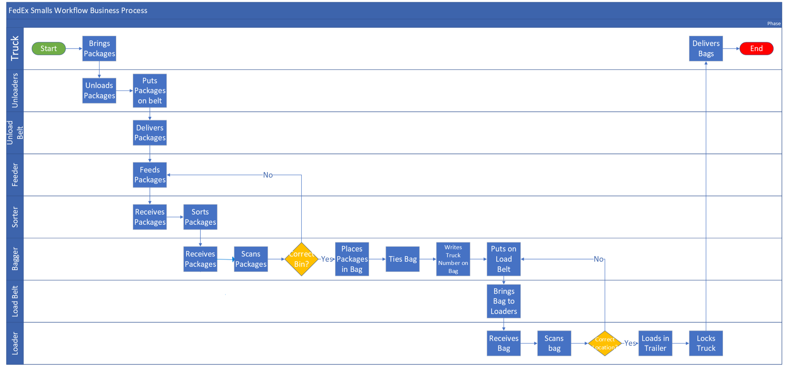
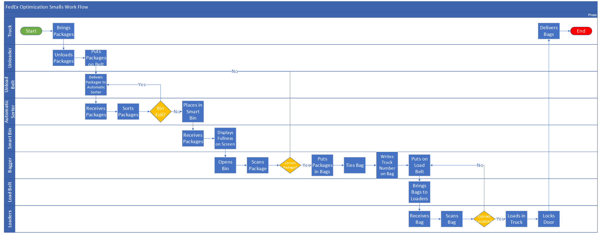

# FedEx Smalls Process Optimization

> A business process optimization case study demonstrating workflow analysis, process mapping, operational analytics, and automation recommendations.

---

## Project Overview

This project evaluates an existing small package sorting process and proposes an optimized future-state workflow designed to improve operational efficiency, reduce manual bottlenecks, and increase package throughput.

The analysis applies business analysis methodologies to identify inefficiencies within the current process and develop a technology-driven solution that aligns with operational goals.

---

## Business Objective

The objective of this project was to answer one question:

**How can package sorting operations become faster, more accurate, and more efficient while reducing manual labor and operational delays?**

---

## Current-State Analysis

The existing process relies heavily on manual labor throughout the package sorting operation.

### Challenges Identified

- Manual package sorting
- Human sorting errors
- Package misloads
- Conveyor bottlenecks
- Overflowing sorting bins
- Reduced employee productivity
- Safety concerns from package overflow
- Delayed package processing

---

## Future-State Solution

The redesigned workflow introduces automation and smart technology to improve efficiency across the operation.

### Proposed Improvements

- Automated package sorting
- Smart sorting bins
- Barcode-driven routing
- Real-time bin capacity monitoring
- Improved package tracking
- Reduced manual handling
- Improved labor utilization
- Lower package misloads

---

## Business Analysis Methods Used

- Business Process Mapping
- Current-State vs Future-State Analysis
- Workflow Optimization
- Process Improvement
- Operational Analysis
- Root Cause Analysis
- KPI Identification
- Business Requirements Analysis

---

## Key Performance Indicators

| KPI | Business Value |
|---|---|
| Packages Sorted per Hour | Measures productivity |
| Packages Bagged per Hour | Measures labor efficiency |
| Misloads per Day | Measures quality |
| Throughput | Measures operational capacity |
| Labor Utilization | Measures workforce efficiency |

---

## Expected Business Impact

- Increased operational efficiency
- Reduced manual bottlenecks
- Improved package accuracy
- Reduced package misloads
- Improved employee productivity
- Increased package throughput
- Better operational decision-making

---

## Process Maps

### Existing Workflow



---

### Optimized Workflow



---

## Skills Demonstrated

- Business Analysis
- Business Process Modeling
- Process Mapping
- Workflow Analysis
- Operational Analytics
- Process Improvement
- Lean Thinking
- Business Intelligence Concepts
- KPI Development
- Systems Analysis

---

## Tools Used

- Microsoft Visio
- Microsoft Word
- Business Process Modeling
- Process Documentation
- Workflow Design

---

## Repository Contents

```text
Small_Package_Process_Optimization_Report.docx
existing_fedEx_smalls_workflow.png
fedEx_smalls_optimization_workflow.png
README.md
```

---

## About This Project

This project was completed as part of graduate-level business analytics coursework and demonstrates practical application of business analysis principles to improve enterprise operations through process redesign and data-driven decision making.

---

## Contact

**Nathan Corpus**

Aspiring Business Analyst | Data Analyst | Operations Analyst
